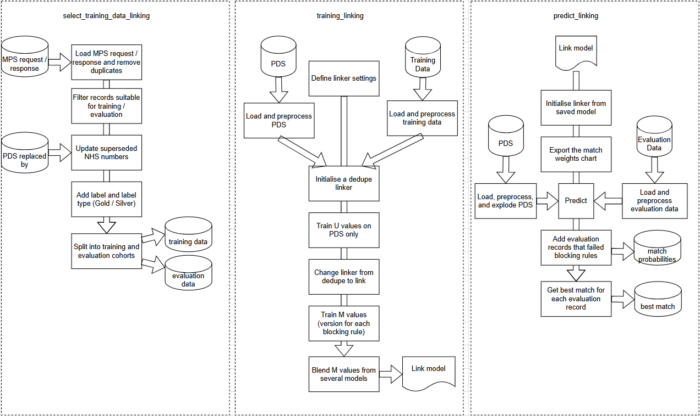
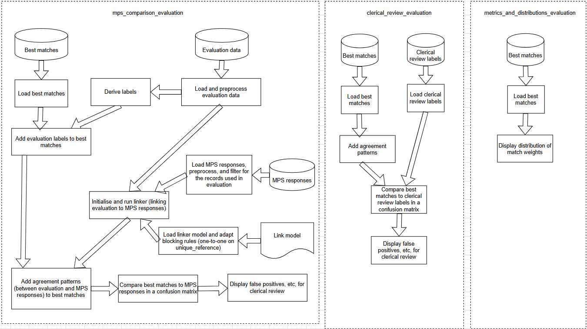
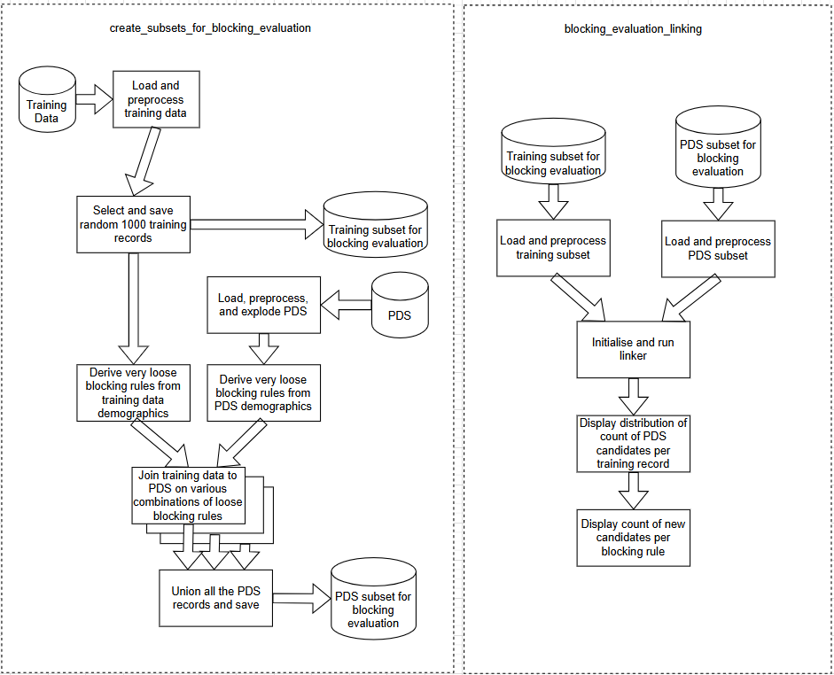

# NHS England Probabilistic Linkage

This pipeline can be used to create and evaluate variations of a probabilistic linkage model, using the [Splink][splink] package, for linking and/or deduplicating record-level data at NHS England.

## Contact

This repository is maintained by the [NHS England Data Science Team][ds-email]. To contact us, please [raise an issue on GitHub][issue-link] or via [email][ds-email]. See our other work on the [NHS England Data Science website][ds-site], including [more information about this project][ds-site-dl].

> [!WARNING]
> This repository may contain references internal to NHS England that cannot be accessed publicly.

## Prerequisites

This project runs on the secure Data Access Environment (DAE) instance of Databricks (runtime version 10.4) at NHS England and uses a Spark cluster with the following installed:

* Abydos 0.5.0
* Levenshtein 0.21.1
* Pandas 1.3.3
* PySpark 2.4.5
* Python 3.7.17
* Splink 3.9.13

This pipeline requires access to datasets including:

* [PDS][pds]
* [MPS archive][mps]
* Nicknames mapping
The nicknames mapping csv (found in documentation/names.csv) comes from: https://pypi.org/project/nicknames/, with some additions found through clerical review. This was then converted into a dictionary using documentation/names_dictionary_converter.py + subsequently a pyspark table saved in our database, for use in the pipeline. 

## About the Pipeline

This pipeline has been developed to test and refine implementations of [Splink][splink] to ultimately create two variations of a probabilistic linkage model:

1. A 'link only' model that can be used to train, apply, and evaluate a linkage model linking [PDS][pds] and another dataset of your choice.
2. A 'dedupe only' model that can be used to train, apply, and evaluate a linkage model to deduplicate PDS.

This repository includes notebooks and functions for setting and evaluating the following steps which are required for training and using a Splink linkage model:
* dataset ingestion
* pre-processing
* blocking rules
* distance metrics
* training
* prediction
* evaluation notebooks
  
These can be used as a full pipeline or as individual building blocks.

> [!NOTE]
> [Splink][splink] is a Python package for probabilistic record linkage that allows you to link and/or deduplicate records from datasets that lack unique identifiers. It was developed and is maintained by a team from the UK's Ministry of Justice.

These diagrams illustrate the structure of the different notebooks in this repository. The diagrams show the `_linkage` version of each notebook, but for each there is also a `_dedupe` version with a similar structure.



### Selecting training data

Notebooks to select subsets of data that are used for training and evaluation:

1. `select_training_data_linking.py` (linkage only)
2. `select_training_data_dedupe.py` (deduplication only)

### Training

Notebooks to train and save the model that gets used in [`predict`](#predict). Can vary by the dataset being trained on, or by the parameters used in the training setup.

1. `training_linking.py` (linkage only)
2. `training_dedupe.py` (deduplication only)
   
### Predict

The predict_linking notebook returns the best matching PDS record for each evaluation record. It also returns all candidate PDS records, which can later be used in evaluation notebooks. The predict_dedupe notebook returns the most likely duplicate records in PDS.

1. `predict_linking.py` (linkage only)
2. `predict_dedupe.py` (deduplication only)
   
### Evaluation

For evaluating linking models, `mps_comparison_evaluation.py` compares the result of the linker to results from MPS, the existing linkage algorithm used by several NHS datasets. `clerical_review_evaluation.py` compares the result of the linker to results that we have clerically labelled. `metrics_and_distributions_evaluation.py` shows the distribution of match weights for the best links.

For evaluating dedupe models, `evaluation_dedupe` compares potential duplicates found by the linker to a set of known duplicates in PDS (known duplicates are based on the existence of PDS records that have been reviewed and superseded by other PDS records).

### Blocking rules evaluation

Notebooks to evaluate the effectiveness of the blocking rules for prediction, according to how many candidate links they generate. Good blocking rules should be strict enough to save the computational cost of multiple comparisons, but not so strict that true links are missed.

1. `blocking_evaluation_linking.py` (linkage only)
2. `blocking_evaluation_dedupe.py` (deduplication only)

### Other folders and notebooks

The `utils` folder contains all the functions used in the notebooks.

The `tests` folder contains unit tests for all the functions, and an integration test for each of the linkage and dedupe pipelines.

`parameters_linking.py` and `parameters_dedupe.py` contains the parameters used in the pipeline.

`run_pipeline.py` is a wrapper notebook from which you can run training, predict, or evaluation, for either the linking or the dedupe pipeline.

`run_tests.py` is a wrapper to run all the unit and integration tests.

### Full repository structure

```
.
│   .gitignore                           <- Files and file types automatically removed from version control for security purposes
│   LICENCE                              <- License information for public distribution
│   README.md                            <- Explanation of the project
|   parameters_dedupe.py                 <- Parameters for the dedupe model
|   parameters_linking.py                <- Parameters for the linking model
│   predict_dedupe.py                    <- Predict the most likely duplicates in PDS
│   predict_linking.py                   <- Predict the most likely PDS record for each evaluation record
|   requirements.txt                     <- Package dependencies
|   run_pipeline.py                      <- Wrapper to run the training, predict, or evaluation notebooks
│   run_tests.py                         <- Runs unit and integration tests
|
└───utils
|        dataset_ingestion_utils.py      <- Functions used in the dataset ingestion.
|        eval_utils.py                   <- Functions used in evaluation.
|        model_utils.py                  <- Functions used in model training.
|        parameter_lists.py              <- Some longer parameters, such as distance metric hierarchies, used in both pipelines.
|        pipeline_utils.py               <- Functions for passing parameters between notebooks.
|        preprocessing_utils.py          <- Functions used in data pre-processing.
|        test_utils.py                   <- Functions used in integration tests.
|
├───tests
|       DAE_only_tests.py                <- Tests for the loading and saving of models, which would only work on the DAE environment.
|       dataset_ingestion_tests.py       <- Unit tests for dataset_ingestion_utils functions
|       eval_tests.py                    <- Unit tests for eval_utils functions
|       function_test_suite.py           <- Class and functions for registering and running tests
|       model_tests.py                   <- Unit tests for model_utils functions
|       preprocessing_tests.py           <- Unit tests for preprocessing_utils functions
|
├───────integration_tests
|           main_dedupe_tests.py         <- Integration test for the dedupe pipeline
|           main_linking_tests.py        <- Integration test for the linking pipeline
|
├───notebooks_dedupe
|       blocking_evaluation_dedupe.py    <- Evaluate the effectiveness of blocking rules in the dedupe model
|       evaluation_dedupe.py             <- Evaluate potential duplicates at different thresholds
|       select_training_data_dedupe.py   <- Select data for training and evaluating the dedupe model
|       training_dedupe.py               <- Train the dedupe model
|
├───notebooks_linking
|       blocking_evaluation_linking.py   <- Evaluate the effectiveness of blocking rules in the linking model
|       clerical_review_evaluation.py    <- Evaluate the results of a linker against human labels
|       create_subsets_for_blocking_evaluation.py  <- Select a small sample of training and PDS data to use to quickly iterate blocking rules
|       metrics_and_distributions_evaluation.py    <- Show the distribution of match weights for the best links
|       mps_comparison_evaluation.py     <- Evaluate the results of a linker against results of MPS
|       select_training_data_linking.py  <- Select data for training and evaluating the linking model
|       training_linking.py              <- Train the linking model
|
└───documentation                        <- Helpful files to aid with pipeline documentation
```

## Licence

Unless stated otherwise, the codebase is released under the [MIT License](LICENCE).

Any HTML or Markdown documentation is [© Crown copyright](https://www.nationalarchives.gov.uk/information-management/re-using-public-sector-information/uk-government-licensing-framework/crown-copyright/) and available under the terms of the [Open Government 3.0 licence](https://www.nationalarchives.gov.uk/doc/open-government-licence/version/3/).

## Acknowledgements

* [Jonathan Laidler](https://github.com/JonathanLaidler)
* [Xiyao Zhuang](https://github.com/xiyaozhuang)
* [Amaia Imaz Blanco](https://github.com/amaiaita)
* [Scarlett Kynoch](https://github.com/scarlett-k-nhs)
* [Giulia Mantovani](https://github.com/GiuliaMantovani1)
* [Harriet Sands](https://github.com/harrietrs)

---
[splink]: https://moj-analytical-services.github.io/splink/index.html
[ds-site]: https://github.com/nhsengland/datascience
[ds-site-dl]: https://nhsengland.github.io/datascience/our_work/data-linkage-hub/linkage-projects/better-matching/
[ds-email]: mailto:datascience@nhs.net
[issue-link]: https://github.com/NHSDigital/splink-linkage-pipeline/issues/new/choose
[pds]: https://digital.nhs.uk/services/personal-demographics-service
[mps]: https://digital.nhs.uk/services/personal-demographics-service/master-person-service
